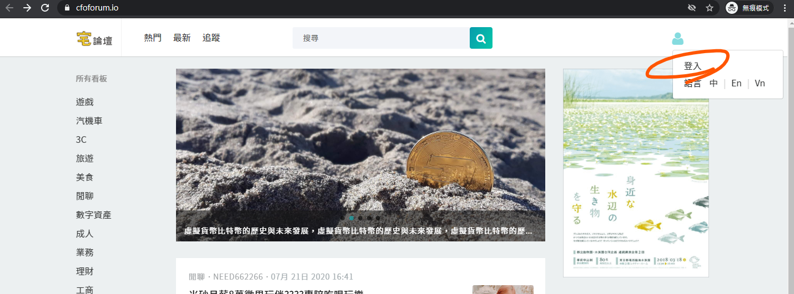
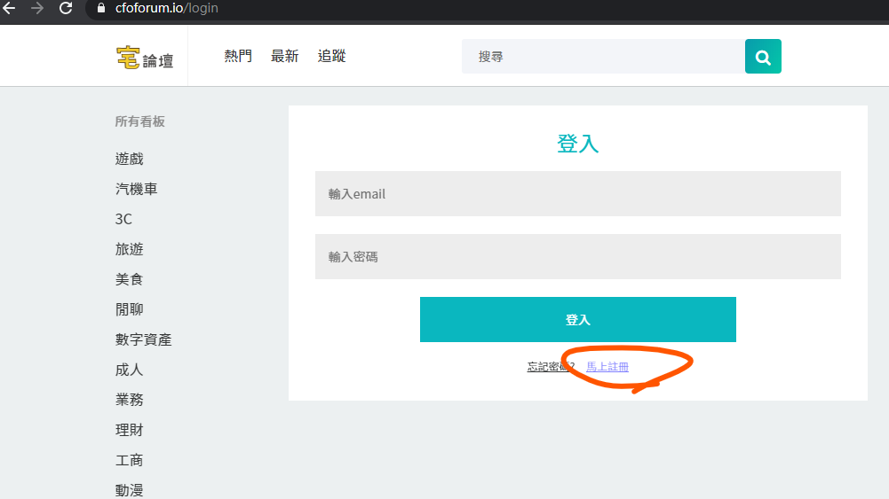
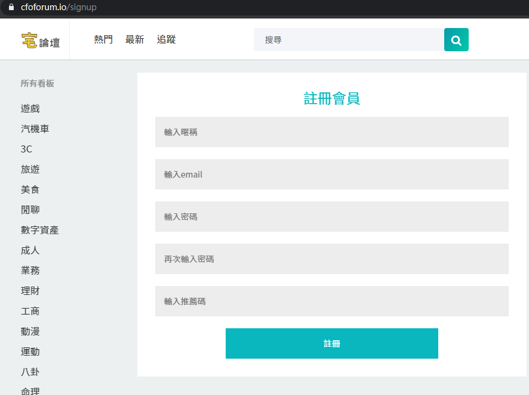
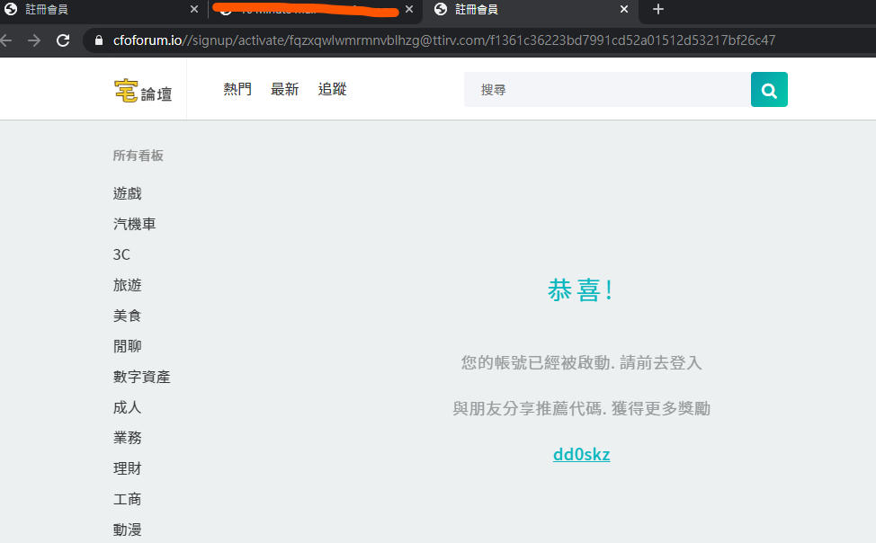
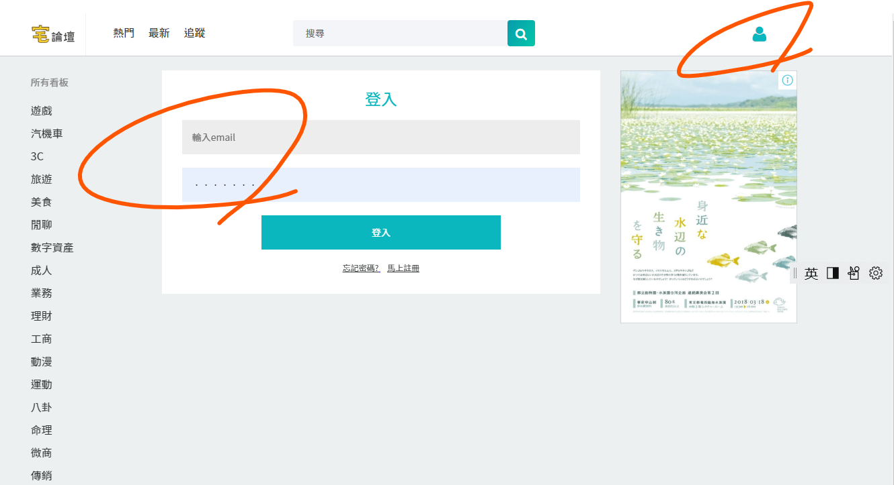
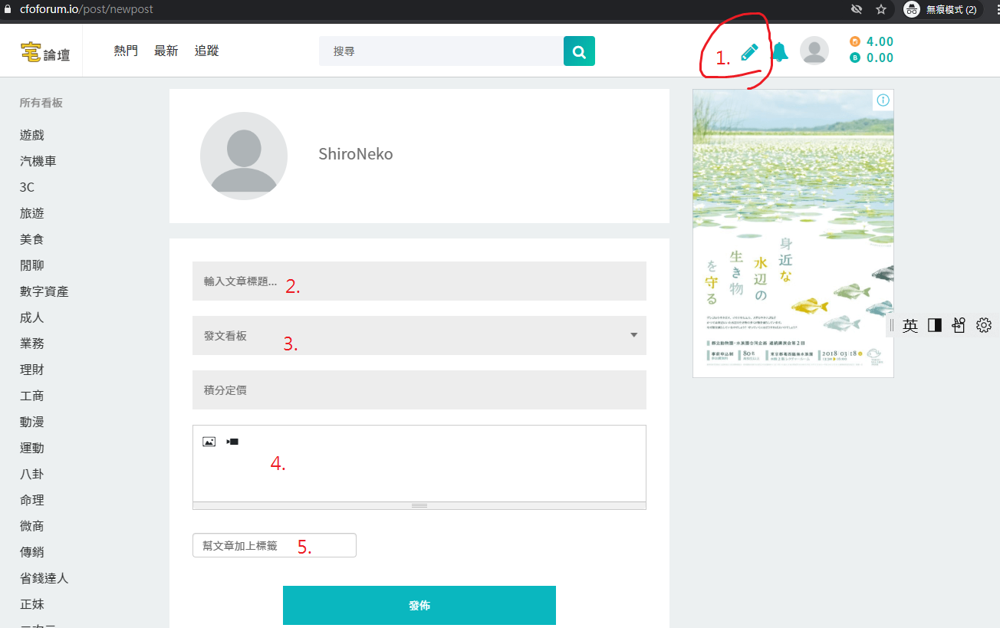
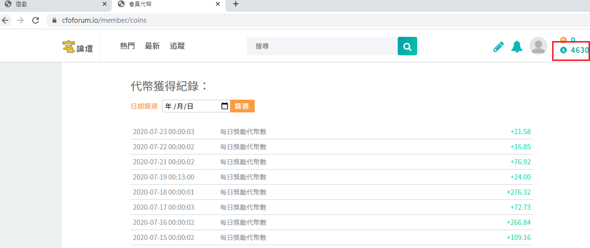
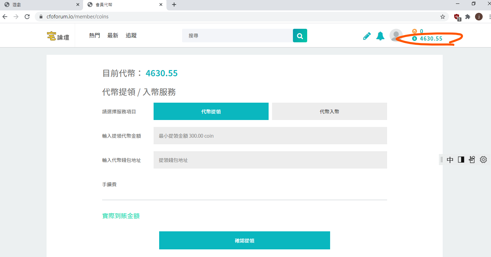

<宅論壇新手教學>

# 註冊
 基本上，一切都從右上角開始
## 1. 填寫註冊資料
1. 按右上角這邊

2. 按這邊

3. 輸入各欄位資料之後，按下「註冊」 (邀請碼可留空不填 ( 填寫邀請碼，對方可以獲得積分！

## 2. 收信認證
- 註冊後，系統將寄發認證信，請至您的註冊信箱收信，並點擊「信中連結」進行認證

## 3. 認證成功
- 看到此畫面代表註冊成功，請記得複製、留存自己的「邀請碼」哦！
- 以後只要有人用您的邀請碼註冊，您就可以獲得積分獎勵！

# 登入
1. 按一下右上角的頭像，點擊「 登入 」，跳轉至登入畫面
2. 輸入帳號 （註冊時使用的 e-mail）、密碼
3. 點擊「 登入 」

# 積分
- 論壇積分「每日」結算。
- 結算後，系統將依「積分貢獻比例」統一分配獎勵代幣
- *代幣可提現，可兌換至您的加密貨幣錢包*

# 如何獲得積分
 以下幾種方式可以賺取積分：
 1. 發文： \
  在任何板塊發表新文章。

 2. 回覆： \
  於別人的文章底下留言、參與討論

 3. 分享： \
  使用「分享」功能，將論壇文章分享至其他社群網站。 \
  目前論壇提供： Line 、 Facebook 、 WeChat 、 Twitter 四種社群分享功能，能夠賺取積分
  
 4. 邀請： \
  當有人透過您的「 邀請碼 」註冊成為會員時

# 撰寫文章

1. 按下右上角的鉛筆圖示，進入發文介面
2. 輸入文章標題
3. 選擇發文看板
4. 輸入文章內容
5. 設定標籤(TAG)關鍵字（選擇性、非必要

# 查詢
- 主畫面右上角的數字代表各項帳號數值，點擊可以查詢細節 \
例：數量、增減明細...等等

# 兌換 （代幣提領、入幣服務）
## 代幣提領
- 可將論壇代幣提領、兌換至您的錢包地址
- 單次提領有代幣數量下限

## 代幣入幣 [尚未開放]
- 按一下，消費您錢包的貨幣，輕鬆轉換成本站代幣
